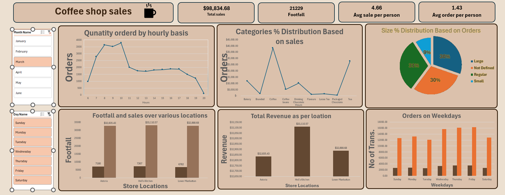

# ☕ Coffee Shop Sales Dashboard (Excel)

An interactive sales dashboard built using Microsoft Excel to analyze coffee shop performance across different dimensions such as sales, footfall, product categories, and customer behavior.

---

## 🚀 Project Overview

This project focuses on transforming raw sales data into meaningful insights using Excel dashboards and visualizations.

The dashboard provides a clear view of:
- Sales trends
- Customer behavior
- Product performance
- Store-wise insights

---

## 📊 Key Metrics

- 💰 Total Sales: $98,834.68  
- 👣 Total Footfall: 21,229  
- 📈 Average Sale per Person: 4.66  
- 🧾 Average Orders per Person: 1.43  

---

## 📸 Dashboard Preview

---

## 📌 Features & Analysis

### ⏰ Sales Trends
- Hourly analysis of quantity ordered
- Identifies peak hours (highest around 8–10 AM)

---

### 📦 Category Distribution
- Sales contribution by product categories
- Coffee category contributes the highest share

---

### 🥤 Order Size Distribution
- Large, Regular, Small breakdown
- Balanced distribution across sizes (~30% each)

---

### 📍 Store Performance
- Sales and footfall comparison across locations:
  - Astoria
  - Hell's Kitchen
  - Lower Manhattan
- Hell’s Kitchen shows highest revenue

---

### 📅 Weekday Analysis
- Orders trend across days
- Higher activity observed toward end of the week

---

## 🛠️ Tools & Techniques Used

- Microsoft Excel
- Pivot Tables
- Charts (Bar, Line, Pie)
- Slicers (Month, Day filters)
- Dashboard Design & Layout

---

## 🎯 Key Insights

- Morning hours drive majority of orders
- Coffee category dominates revenue generation
- Certain locations outperform in both sales and footfall
- Weekend demand is consistently higher

---

## 📁 Project Structure
